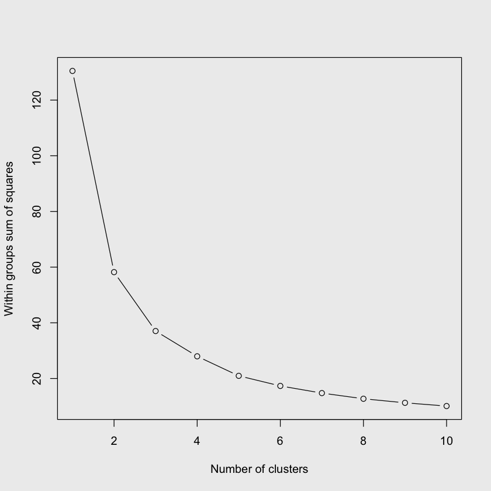

# Clustering Analysis

## Clustering

Clustering is a type of unsupervised learning where the goal is to group similar data points together based on certain features—without having prior labels for groups. Clustering algorithms find natural groupings in data called clusters. Each cluster represents data points that are similar to one another in some way. 

<aside>
💡 Example: Streaming Service Preferences

This is a statistical concept that has a lot of real world use. To highlight its importance, look at streaming services such as Netflix and Hulu which create clusters based on users who like similar movies. This is done through **collaborative filtering**, *In collaborative filtering, the idea is to fill in the missing entries of a user-item association matrix.*

For example, consider *a matrix where the rows represent users, the columns represent movies, and the entries represent the ratings that the users have given to the movies*. Many entries of this matrix will be missing because not all users rate all movies. *Collaborative filtering aims to predict these missing entries (ratings) by assuming that similar users will rate similar movies* 

</aside>

## Clustering Methods: K-means with Euclidean Distance

In clustering, particularly in the k-means algorithm, Euclidean distance plays a crucial role in forming clusters. The algorithm uses Euclidean distance to assign each data point to the nearest cluster centroid. Here’s a brief outline of how the k-means algorithm, utilizing Euclidean distance, works:

1. **Initialization**: Choose *k* initial centroids (where *k* is the number of clusters you want to create). *We are going to use the ‘elbow technique’ for this*
2. **Assignment**: Assign each data point to the nearest centroid. *The "nearest" is determined by calculating the Euclidean distance between each data point and each centroid.*
3. **Update**: Calculate the *new centroids by finding the mean of all the data points assigned to each centroid.*
4. **Repeat**: Repeat the assignment and update steps until the centroids no longer change (or until some other stopping condition is met).

## ****Using the Sepal Data in R for Clustering****

The Iris dataset (included in R by default) contains measurements for 150 iris flowers from each of three species. The four measurements are the lengths and the widths of the sepals and petals.

For the purposes of clustering, we can ignore the species of the flower and attempt to cluster the flowers based on the sepal length and width, treating the species as clusters. After clustering, we can compare our cluster assignments with the actual species to analyze the Type 1 and Type 2 errors.

We are going to use the **Elbow Method**, which is technique used to determine the optimal number of clusters in a dataset. *The method involves plotting the explained variation as a function of the number of clusters and picking the "elbow" of the curve as the number of clusters to use.*

```python
# Load the iris dataset
data(iris)

# Extract the sepal length and width
sepal_data <- iris[, 1:2]

# Compute total within-cluster sum of squares for k = 1 to k = 10
set.seed(123)
wss <- sapply(1:10, function(k) {
  kmeans(sepal_data, centers = k, nstart = 10)$tot.withinss
})
par(bg="#ededed")

# Plot the total within-cluster sum of squares for each k
plot(1:10, wss, type = "b", xlab = "Number of clusters", ylab = "Within groups sum of squares")
```



### Interpreting the ‘elbow’ plot

- The **`sapply`** function is used to apply the **`kmeans`** function to **`sepal_data`** for *k* from 1 to 10.
- The **`tot.withinss`** element from the output of **`kmeans`** gives the total within-cluster sum of squares.
- The **`plot`** function is used to create a plot of the total within-cluster sum of squares for each *k*.

The reason they call it the elbow technique is because where the cluster points start to curve about 45 degrees (similar to an elbow) that is how you know how many clusters to make. 

Therefore, from this particular graph, it seems that there is evidence for 3 clusters, so we are going to make k = 3. 

### Performing k-means Clustering on Sepal Data

```python
# Load the iris dataset
data(iris)

# Extract the sepal length and width
sepal_data <- iris[, 1:2]

# Perform k-means clustering with k = 3 (since we have three species)
set.seed(123) # Setting seed for reproducibility
clustering <- kmeans(sepal_data, centers = 3)

# View the cluster assignments and centroids
print(clustering)

# Add the cluster assignments to the original iris data
iris$cluster <- clustering$cluster

# Compare the cluster assignments with the actual species
table(iris$Species, iris$cluster)
```

```R
OUTPUT: 

K-means clustering with 3 clusters of sizes 50, 53, 47

Cluster means:
  Sepal.Length Sepal.Width
1     5.006000    3.428000
2     5.773585    2.692453
3     6.812766    3.074468

Clustering vector:
  [1] 1 1 1 1 1 1 1 1 1 1 1 1 1 1 1 1 1 1 1 1 1 1 1 1 1 1 1 1 1 1 1 1 1 1 1 1 1
 [38] 1 1 1 1 1 1 1 1 1 1 1 1 1 3 3 3 2 3 2 3 2 3 2 2 2 2 2 2 3 2 2 2 2 2 2 2 2
 [75] 3 3 3 3 2 2 2 2 2 2 2 2 3 2 2 2 2 2 2 2 2 2 2 2 2 2 3 2 3 3 3 3 2 3 3 3 3
[112] 3 3 2 2 3 3 3 3 2 3 2 3 2 3 3 2 2 3 3 3 3 3 2 2 3 3 3 2 3 3 3 2 3 3 3 2 3
[149] 3 2

Within cluster sum of squares by cluster:
[1] 13.1290 11.3000 12.6217
 (between_SS / total_SS =  71.6 %)

Available components:

[1] "cluster"      "centers"      "totss"        "withinss"     "tot.withinss"
[6] "betweenss"    "size"         "iter"         "ifault"      
            
              1  2  3
  setosa     50  0  0
  versicolor  0 38 12
  virginica   0 15 35
```

### Interpreting k-means Clustering on Sepal Data

Below is a breakdown of each section of the output:

**Cluster Sizes**

- There are three clusters with sizes 50, 53, and 47.
- This means that 50 data points have been assigned to the first cluster, 53 to the second, and 47 to the third.

**Cluster Means:**

- The cluster centers (mean sepal length and width for each cluster) are provided.
- Cluster 1: Mean Sepal Length = 5.006, Mean Sepal Width = 3.428 5.006 3.428
- Cluster 2: Mean Sepal Length = 5.774, Mean Sepal Width = 2.69 5.774 2.692
- Cluster 3: Mean Sepal Length = 6.813, Mean Sepal Width = 3.07 6.813 3.074

These are the centroids of the clusters in the feature space.

**Clustering Vector:**

- This part shows the cluster assignments for each data point.
- For example, the first 50 data points are assigned to cluster 1, indicating they are most likely the setosa species.

**Within Cluster Sum of Squares by Cluster:**

- This section shows the within-cluster sum of squares for each cluster.
- It is a measure of the compactness of the clusters; lower values are generally better as they indicate that the data points are closer to the centroids of their respective clusters.
- The values are 13.1290 for cluster 1, 11.3000 for cluster 2, and 12.6217 for cluster 3. 13.1290 11.3000 12.6217

The between_SS / total_SS value of 71.6% indicates that *71.6% of the total variation is explained by the clustering, a relatively high percentage, suggesting a good cluster separation.*

**Available Components:**

- Lists the available components in the clustering result object, such as "cluster" (cluster assignments), "centers" (cluster centroids), and "withinss" (within-cluster sum of squares).

**Confusion Matrix:**

- The matrix at the end compares the actual species (setosa, versicolor, virginica) with the predicted clusters (1, 2, 3).
- **Reading the matrix:**
    - *All 50 setosa are correctly clustered in cluster 1* (0 Type 1 or Type 2 errors for setosa).
    - *Versicolor: 38 are in cluster 2 (correct), and 12 are in cluster 3 (Type 1 error).*
    - *Virginica: 35 are in cluster 3 (correct), and 15 are in cluster 2 (Type 1 error).*

This matrix is useful for assessing the performance of the clustering by examining the Type 1 (False Positive) and Type 2 (False Negative) errors.

### **Summary:** Performing k-means Clustering on Sepal Data

- The k-means algorithm has been used to cluster the data into 3 clusters based on sepal dimensions
- The clusters align relatively well with the actual species, *with some errors in classification particularly between versicolor and virginica.*
- The within-cluster sum of squares and the percentage of between_SS to total_SS indicate a relatively good fit of the clusters to the data.

### Visualizing & Improving Clustering Accuracy

We can see that based on our analysis, Setosa was correctly identified with no error. However, Versicolor and Virginica had a decent amount of type 1 and type 2 errors. One way to understand how the model incorrectly predicted these clusters, we can compare graphs. 

### **Plotting Data Based on Species VS k-means Cluster Data**

Sometimes it is difficult to identify shortcomings of statistical models such as k-means clustering based in different situations. *Sometimes interpreting statistics are more meaningful when we have a visual graphic in addition to the numerical representations.* 

What we are going to do is graph both the data based on the Species and the data based on the k-means calculated clusters. **What makes the iris dataset so unique is** *that we have 3 different variables: Sepal Length, Sepal Width, and Petal Length can all be recorded and possibly related to one another.* 

We are going to graph both of these side to side in 2-dimensions first, then we are going to do 3-dimensions and see how they can help us understand these clusters more. 

### 2D Plot: Species VS k-means Cluster Data

Species Data:

```python
par(bg="#ededed", mfrow=c(2,2))
# 2D scatter plot of actual species
plot(iris$Sepal.Length, iris$Sepal.Width, col = iris$Species,
     xlab = "Sepal Length", ylab = "Sepal Width", pch = 19,
     main = "2D Plot of Actual Species")
legend("topright", legend = levels(iris$Species), col = 1:3, pch = 19)

plot(iris$Sepal.Length, iris$Petal.Length, col = iris$Species,
     xlab = "Sepal Length", ylab = "Petal Length", pch = 19,
     main = "2D Plot of Actual Species")
legend("topright", legend = levels(iris$Species), col = 1:3, pch = 19)

plot(iris$Petal.Length,iris$Sepal.Width , col = iris$Species,
     xlab = "Petal Length", ylab = "Sepal Length", pch = 19,
     main = "2D Plot of Actual Species")
legend("topright", legend = levels(iris$Species), col = 1:3, pch = 19)
```


k-means Cluster Data

```python
# Add the cluster assignments to the original data
iris$cluster <- as.factor(clustering$cluster)

# Setting up the plotting area
par(bg="#ededed", mfrow=c(2,2))

# 2D scatter plot of k-means clusters (Sepal.Length vs Sepal.Width)
plot(iris$Sepal.Length, iris$Sepal.Width, col = iris$cluster,
     xlab = "Sepal Length", ylab = "Sepal Width", pch = 19,
     main = "2D Plot of K-means Clusters")
legend("topright", legend = levels(iris$cluster), col = 1:3, pch = 19)

# 2D scatter plot of k-means clusters (Sepal.Length vs Petal.Length)
plot(iris$Sepal.Length, iris$Petal.Length, col = iris$cluster,
     xlab = "Sepal Length", ylab = "Petal Length", pch = 19,
     main = "2D Plot of K-means Clusters")
legend("topright", legend = levels(iris$cluster), col = 1:3, pch = 19)

# 2D scatter plot of k-means clusters (Petal.Length vs Sepal.Width)
plot(iris$Petal.Length, iris$Sepal.Width, col = iris$cluster,
     xlab = "Petal Length", ylab = "Sepal Width", pch = 19,
     main = "2D Plot of K-means Clusters")
legend("topright", legend = levels(iris$cluster), col = 1:3, pch = 19)
```


### Interpretation (2D Plot: Species VS k-means Cluster Data)

These 2D plots explain the short comings in our data pretty well. If we go back to our summary statistic. We concluded the following: 

- The clusters align relatively well with the actual species, *with some errors in classification particularly between versicolor and virginica.*

When we look at both the 2D plot of the actual species and the k-means clusters we find that it is extremely accurate in differentiating Setosa because those values are much different on all 3 variables from *versicolor and virginica.*

When we look at the actual *versicolor and virginica* data, we find that specifically the Sepal Length * Sepal Width Graph on the top right has a ton of overlap between species. For instance, though the majority of the *virginica* have Sepal Lengths that are higher than *versicolor*. There is one plant on the left side that is a *virginica*. 

When we look at the 2D plot of the k-means clusters we see that for that particular graph, two distinct groups with no overlap were created. but the reality is that there is a ton of overlap and this statistic is creating relationships that are not there. 

### 3D Plot: Species VS k-means Cluster Data

Species Data: 

```python
par(bg="#ededed", mfrow=c(2,2))

# install.packages("plotly")# 3D scatter plot of actual species
color_species <- as.integer(iris$Species)

scatterplot3d(iris$Sepal.Length, iris$Sepal.Width, iris$Petal.Length, 
              color = color_species, pch = 19, angle = 45,
              main = "3D Plot of Actual Species", 
              xlab = "Sepal Length", ylab = "Sepal Width", zlab = "Petal Length")
legend("right", legend = levels(iris$Species), col = 1:3, pch = 19)

scatterplot3d(iris$Sepal.Length, iris$Sepal.Width, iris$Petal.Length, 
              color = color_species, pch = 19, angle = 125,
              main = "3D Plot of Actual Species", 
              xlab = "Sepal Length", ylab = "Sepal Width", zlab = "Petal Length")
legend("right", legend = levels(iris$Species), col = 1:3, pch = 19)

scatterplot3d(iris$Sepal.Length, iris$Sepal.Width, iris$Petal.Length, 
              color = color_species, pch = 19, angle = 225,
              main = "3D Plot of Actual Species", 
              xlab = "Sepal Length", ylab = "Sepal Width", zlab = "Petal Length")
legend("right", legend = levels(iris$Species), col = 1:3, pch = 19)

scatterplot3d(iris$Sepal.Length, iris$Sepal.Width, iris$Petal.Length, 
              color = color_species, pch = 19, angle = 325,
              main = "3D Plot of Actual Species", 
              xlab = "Sepal Length", ylab = "Sepal Width", zlab = "Petal Length")
legend("right", legend = levels(iris$Species), col = 1:3, pch = 19)
```


k-means Cluster Data

```python
# Setting up the plotting area
par(bg="#ededed", mfrow=c(2,2))

# Assign cluster color
color_cluster <- as.integer(iris$cluster)

# 3D scatter plot of k-means clusters (angle = 45)
scatterplot3d(iris$Sepal.Length, iris$Sepal.Width, iris$Petal.Length, 
              color = color_cluster, pch = 19, angle = 45,
              main = "3D Plot of K-means Clusters", 
              xlab = "Sepal Length", ylab = "Sepal Width", zlab = "Petal Length")
legend("right", legend = levels(iris$cluster), col = 1:3, pch = 19)

# 3D scatter plot of k-means clusters (angle = 125)
scatterplot3d(iris$Sepal.Length, iris$Sepal.Width, iris$Petal.Length, 
              color = color_cluster, pch = 19, angle = 125,
              main = "3D Plot of K-means Clusters", 
              xlab = "Sepal Length", ylab = "Sepal Width", zlab = "Petal Length")
legend("right", legend = levels(iris$cluster), col = 1:3, pch = 19)

# 3D scatter plot of k-means clusters (angle = 225)
scatterplot3d(iris$Sepal.Length, iris$Sepal.Width, iris$Petal.Length, 
              color = color_cluster, pch = 19, angle = 225,
              main = "3D Plot of K-means Clusters", 
              xlab = "Sepal Length", ylab = "Sepal Width", zlab = "Petal Length")
legend("right", legend = levels(iris$cluster), col = 1:3, pch = 19)

# 3D scatter plot of k-means clusters (angle = 325)
scatterplot3d(iris$Sepal.Length, iris$Sepal.Width, iris$Petal.Length, 
              color = color_cluster, pch = 19, angle = 325,
              main = "3D Plot of K-means Clusters", 
              xlab = "Sepal Length", ylab = "Sepal Width", zlab = "Petal Length")
legend("right", legend = levels(iris$cluster), col = 1:3, pch = 19)
```


### Interpretation (2D Plot: Species VS k-means Cluster Data)

When we interpret this data in 3 dimensions, it acts as a reinforcement of what we perceived from the 2D Plots. We see that when we look at both the 3D plot of the actual species and the k-means clusters we find that it is extremely accurate in differentiating Setosa because those values are much different on all 3 variables from *versicolor and virginica.*

The 3D Plot does a good idea at visualizing how large the cluster areas are across the 3 variables. But in terms of relationships, we don’t get any evident new findings. 

### ****Conclusion: The Importance of Thorough Exploration in Understanding Clusters****

Through the extensive exploration of the Iris dataset for clustering based on Sepal data, we have observed the critical role of various statistical methods and visual analyses in understanding and interpreting the behavior of clusters. Our journey from employing the **Elbow Method** to ascertain the optimal number of clusters to utilizing **k-means** for cluster formation and further evaluating the clustering with actual species data has been illuminating.

**Key Observations:**

1. **Elbow Method**: This provided initial insights into the possible number of clusters, *directing our subsequent analyses and ensuring we did not over or under-cluster the data.*
2. **k-means Clustering**: *The application of k-means clustering revealed how data points are grouped based on similarities in sepal dimensions*, offering a preliminary understanding of cluster behavior.
3. **Error Analysis**: Evaluating *Type 1 and Type 2* errors post-clustering allowed us to gauge the accuracy and reliability of our clustering efforts.
4. **2D and 3D Visualization**: *Plotting the clusters in two and three dimensions reinforced and supplemented our statistical findings*, offering a visual representation of cluster distributions, overlaps, and separations.\

**The Power of Visualization:**

While numerical and statistical evaluations provided a solid foundation, the power of visualization emerged as an invaluable tool. *The 2D and 3D plots illuminated the cluster characteristics, overlaps, and differentiations that were not immediately apparent from statistical output alone.* It allowed for a more comprehensive and detailed understanding, highlighting areas of success and points of contention in our clustering approach.

**Insights and Adjustments:**

The visual analyses, particularly the comparison between actual species data and k-means cluster data, *underscored the precise and distinct identification of Setosa. However, it also highlighted the areas of overlap and misclassification, especially between Versicolor and Virginica, urging a reconsideration of feature selection or clustering approach.*

**Final Thoughts:**

In conclusion, the depth and breadth of this exploration emphasize the indispensability of a multifaceted approach to understanding clusters in data. Moving beyond mere numerical and statistical analyses to incorporate visual evaluations ensures a more rounded, detailed, and comprehensive insight into the data's cluster behavior. This holistic approach aids in not only interpreting the current clustering but also in making informed adjustments for enhanced future clustering efforts. It underscores the essence of exploration in unearthing the stories data holds, guiding us toward more accurate, reliable, and insightful data analyses in our ongoing quest for knowledge discovery.