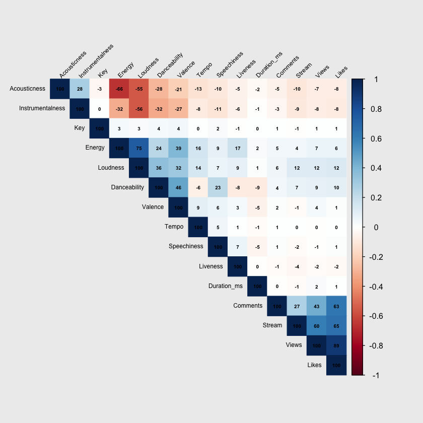

# Spotify Data Exploration

# About our Dataset

[Spotify and Youtube](https://www.kaggle.com/datasets/salvatorerastelli/spotify-and-youtube)

Dataset of songs of various artist in the world and for each song is present:

- Several statistics of the music version on spotify, including the number of streams;
- Number of views of the official music video of the song on youtube.

## Variables in DataSet

It includes 26 variables for each of the songs collected from spotify. These variables are briefly described next:

- **Track**: name of the song, as visible on the Spotify platform.
- **Artist**: name of the artist.
- **Url_spotify**: the Url of the artist.
- **Album**: the album in wich the song is contained on Spotify.
- **Album_type**: indicates if the song is relesead on Spotify as a single or contained in an album.
- **Uri**: a spotify link used to find the song through the API.
- **Danceability**: describes how suitable a track is for dancing based on a combination of musical elements including tempo, rhythm stability, beat strength, and overall regularity. A value of 0.0 is least danceable and 1.0 is most danceable.
- **Energy**: is a measure from 0.0 to 1.0 and represents a perceptual measure of intensity and activity. Typically, energetic tracks feel fast, loud, and noisy. For example, death metal has high energy, while a Bach prelude scores low on the scale. Perceptual features contributing to this attribute include dynamic range, perceived loudness, timbre, onset rate, and general entropy.
- **Key**: the key the track is in. Integers map to pitches using standard Pitch Class notation. E.g. 0 = C, 1 = C♯/D♭, 2 = D, and so on. If no key was detected, the value is -1.
- **Loudness**: the overall loudness of a track in decibels (dB). Loudness values are averaged across the entire track and are useful for comparing relative loudness of tracks. Loudness is the quality of a sound that is the primary psychological correlate of physical strength (amplitude). Values typically range between -60 and 0 db.
- **Speechiness**: detects the presence of spoken words in a track. The more exclusively speech-like the recording (e.g. talk show, audio book, poetry), the closer to 1.0 the attribute value. Values above 0.66 describe tracks that are probably made entirely of spoken words. Values between 0.33 and 0.66 describe tracks that may contain both music and speech, either in sections or layered, including such cases as rap music. Values below 0.33 most likely represent music and other non-speech-like tracks.
- **Acousticness**: a confidence measure from 0.0 to 1.0 of whether the track is acoustic. 1.0 represents high confidence the track is acoustic.
- **Instrumentalness**: predicts whether a track contains no vocals. "Ooh" and "aah" sounds are treated as instrumental in this context. Rap or spoken word tracks are clearly "vocal". The closer the instrumentalness value is to 1.0, the greater likelihood the track contains no vocal content. Values above 0.5 are intended to represent instrumental tracks, but confidence is higher as the value approaches 1.0.
- **Liveness**: detects the presence of an audience in the recording. Higher liveness values represent an increased probability that the track was performed live. A value above 0.8 provides strong likelihood that the track is live.
- **Valence**: a measure from 0.0 to 1.0 describing the musical positiveness conveyed by a track. Tracks with high valence sound more positive (e.g. happy, cheerful, euphoric), while tracks with low valence sound more negative (e.g. sad, depressed, angry).
- **Tempo**: the overall estimated tempo of a track in beats per minute (BPM). In musical terminology, tempo is the speed or pace of a given piece and derives directly from the average beat duration.
- **Duration_ms**: the duration of the track in milliseconds.
- **Stream**: number of streams of the song on Spotify.
- **Url_youtube**: url of the video linked to the song on Youtube, if it have any.
- **Title**: title of the videoclip on youtube.
- **Channel**: name of the channel that have published the video.
- **Views**: number of views.
- **Likes**: number of likes.
- **Comments**: number of comments.
- **Description**: description of the video on Youtube.
- **Licensed**: Indicates whether the video represents licensed content, which means that the content was uploaded to a channel linked to a YouTube content partner and then claimed by that partner.
- **official_video**: boolean value that indicates if the video found is the official video of the song.

# Importing Data Into R

We are going to run this code in our local R environment and add the path where your CSV file is located. *This code will load the dataset and display the first few rows, allowing you to inspect the data*.

```python
# Loading the dataset
dataset_path <- "Spotify_Youtube.csv"
data <- read.csv(dataset_path)

# Inspecting the first few rows of the dataset
head(data)

```

| X | Artist | Url_spotify | Track | Album | Album_type | Uri | Danceability | Energy | Key | ... | Url_youtube | Title | Channel | Views | Likes | Comments | Description | Licensed | official_video | Stream |
| --- | --- | --- | --- | --- | --- | --- | --- | --- | --- | --- | --- | --- | --- | --- | --- | --- | --- | --- | --- | --- |
| 1 | 0 | Gorillaz | https://open.spotify.com/artist/3AA28KZvwAUcZuOKwyblJQ | Feel Good Inc. | Demon Days | album | spotify:track:0d28khcov6AiegSCpG5TuT | 0.818 | 0.705 | 6 | ... | https://www.youtube.com/watch?v=HyHNuVaZJ-k | Gorillaz - Feel Good Inc. (Official Video) | Gorillaz | 693555221 | 6220896 | 169907 | Official HD Video for Gorillaz' fantastic track Feel Good Inc. Follow Gorillaz online: http://gorillaz.com http://facebook.com/Gorillaz http://twitter.com/GorillazBand http://instagram/Gorillaz For more information on Gorillaz don't forget to check out the official website at http://www.gorillaz.com | True | True |
| 2 | 1 | Gorillaz | https://open.spotify.com/artist/3AA28KZvwAUcZuOKwyblJQ | Rhinestone Eyes | Plastic Beach | album | spotify:track:1foMv2HQwfQ2vntFf9HFeG | 0.676 | 0.703 | 8 | ... | https://www.youtube.com/watch?v=yYDmaexVHic | Gorillaz - Rhinestone Eyes [Storyboard Film] (Official Music Video) | Gorillaz | 72011645 | 1079128 | 31003 | The official video for Gorillaz - Rhinestone Eyes Rhinestone Eyes is taken from the 2010 album Plastic Beach including the singles Rhinestone Eyes, Stylo, Superfast Jellyfish and On Melancholy Hill. Follow Gorillaz online: https://instagram.com/gorillaz<80><8b> https://tiktok.com/@gorillaz https://twitter.com/gorillaz<80><8b> https://facebook.com/gorillaz<80><8b> https://gorillaz.com #Gorillaz #RhinestoneEyes #PlasticBeach | True | True |


## Removing Column Variables

**This dataset has 26 unique variables**, and each are interesting for different reasons. *However, for the purpose of statistical analysis some of them are not necessary*. An example is the Youtube URL `Url_youtube`. So this code is going to remove those values. 

```python
# Removing specified columns
data <- data[, !(names(data) %in% c('X', 'Url_spotify', 'Uri', 'Url_youtube', 'Title', 'Channel', 'Description', 'Licensed', 'official_video'))]

# Inspecting the first few rows of the updated dataset
head(data, n=2)
```
| Artist | Track | Album | Album_type | Danceability | Energy | Key | Loudness | Speechiness | Acousticness | Instrumentalness | Liveness | Valence | Tempo | Duration_ms | Views | Likes | Comments | Stream |
| --- | --- | --- | --- | --- | --- | --- | --- | --- | --- | --- | --- | --- | --- | --- | --- | --- | --- | --- |
| Gorillaz | Feel Good Inc. | Demon Days | album | 0.818 | 0.705 | 6 | -6.679 | 0.1770 | 0.00836 | 0.002330 | 0.6130 | 0.772 | 138.559 | 222640 | 693555221 | 6220896 | 169907 | 1040234854 |
| Gorillaz | Rhinestone Eyes | Plastic Beach | album | 0.676 | 0.703 | 8 | -5.815 | 0.0302 | 0.08690 | 0.000687 | 0.0463 | 0.852 | 92.761 | 200173 | 72011645 | 1079128 | 31003 | 310083733 |

## Changing Variable Types of Analysis

Sometimes when data is imported into R from a .CSV, R will assign a datatype that is not always what is needed for our statistical analysis. *In this case, the column Album_Type is a character when we need it to be a factor since it has two levels (e.g., album or single)*. Here is the code we can run to accomplish this. 

```python
# Converting 'Album_Type' to a factor using another approach
data$Album_type  = as.factor(data$Album_type )

# Checking the structure of the dataset to ensure the change
kable(head(data, n=2))
```

| Artist | Track | Album | Album_type | Danceability | Energy | Key | Loudness | Speechiness | Acousticness | Instrumentalness | Liveness | Valence | Tempo | Duration_ms | Views | Likes | Comments | Stream |
| --- | --- | --- | --- | --- | --- | --- | --- | --- | --- | --- | --- | --- | --- | --- | --- | --- | --- | --- |
| Gorillaz | Feel Good Inc. | Demon Days | album | 0.818 | 0.705 | 6 | -6.679 | 0.1770 | 0.00836 | 0.002330 | 0.6130 | 0.772 | 138.559 | 222640 | 693555221 | 6220896 | 169907 | 1040234854 |
| Gorillaz | Rhinestone Eyes | Plastic Beach | album | 0.676 | 0.703 | 8 | -5.815 | 0.0302 | 0.08690 | 0.000687 | 0.0463 | 0.852 | 92.761 | 200173 | 72011645 | 1079128 | 31003 | 310083733 |

## Determining Scope of Analysis

*When we are doing exploratory analysis, it is important to make sure we are intentionally about what variables we want to analyze*. In this case, we have 19 different variables and making a histogram displaying all distributions may now be as informative in terms of obtaining an understanding of the data. So here are some methods we can use to determine a good place to start. 

### Correlation Analysis

Calculate the correlation between the numerical variables. Variables that are strongly correlated with the target variable (or with each other) could be particularly interesting to investigate.

```python
# Makes sure there are no NA values that would prevent correlational analysis
data = na.omit(data)

# Calculating correlation matrix
correlation_matrix = cor(data[, sapply(data, is.numeric)])

# Viewing the correlation matrix
print(correlation_matrix)
```

```python
OUTPUT: 
Output exceeds the size limit. Open the full output data in a text editor
                 Danceability      Energy          Key    Loudness  Speechiness
Danceability       1.00000000  0.23795119  0.038905854  0.35764475  0.226462459
Energy             0.23795119  1.00000000  0.032285077  0.74533654  0.088821922
Key                0.03890585  0.03228508  1.000000000  0.02759720  0.021748837
Loudness           0.35764475  0.74533654  0.027597203  1.00000000  0.068065186
Speechiness        0.22646246  0.08882192  0.021748837  0.06806519  1.000000000
Acousticness      -0.28131596 -0.66216564 -0.031969319 -0.55277833 -0.098166678
Instrumentalness  -0.32149092 -0.31680693  0.001361016 -0.55615580 -0.112537996
Liveness          -0.08338306  0.17428457 -0.007910276  0.08698760  0.066032877
Valence            0.46322687  0.39168448  0.044202400  0.31597705  0.060491252
Tempo             -0.06316245  0.15530870  0.002148244  0.14280247  0.050474137
Duration_ms       -0.08933298  0.02400227  0.002660081  0.01190575 -0.049325068
Views              0.08832821  0.06716694  0.009051590  0.11826792 -0.009980117
Likes              0.09847928  0.06274692  0.007713687  0.12359979  0.012566658
Comments           0.04341005  0.04524318  0.007819681  0.05914385  0.010136779
Stream             0.07193180  0.04468378 -0.007610239  0.11892652 -0.016246401
                 Acousticness Instrumentalness      Liveness     Valence
Danceability      -0.28131596     -0.321490916 -0.0833830621  0.46322687
Energy            -0.66216564     -0.316806933  0.1742845662  0.39168448
Key               -0.03196932      0.001361016 -0.0079102762  0.04420240
Loudness          -0.55277833     -0.556155796  0.0869876023  0.31597705
Speechiness       -0.09816668     -0.112537996  0.0660328773  0.06049125
Acousticness       1.00000000      0.282588484 -0.0525546772 -0.20560906
Instrumentalness   0.28258848      1.000000000 -0.0571593433 -0.27026942
Liveness          -0.05255468     -0.057159343  1.0000000000  0.03181989
...
Views             0.431458126  0.602563218
Likes             0.631543862  0.654925409
Comments          1.000000000  0.267858410
Stream            0.267858410  1.000000000
```

The way this data is presented is not very informative, so we are going to use an **R package called `corrplot`** *that we can create a graphical representation of the correlation matrix using a heat-map, where different colors represent different levels of correlation between variables*. This can make it easier to interpret the correlations visually. Below is how you can create a correlation heat-map in R.

```python
install.packages("corrplot")
# Loading the necessary library
library(corrplot)

# Calculating the correlation matrix
correlation_matrix <- cor(data[, sapply(data, is.numeric)])

# Creating a correlation heatmap with adjustments
corrplot(correlation_matrix, method="color", type="upper", order="hclust", 
         addCoef.col = "black", # Add correlation coefficients on the plot
         tl.col="black", tl.srt=45, # Text label color and rotation
         tl.cex = 0.6, # Text label size
         addCoefasPercent = TRUE, # Show coefficients as percent
         number.cex = 0.5) # Coefficient text size
```



## Interpreting the Heat Map of Correlations

When analyzing a heat-map, you're essentially looking at a visual representation of the correlation matrix. A heat-map uses colors to represent the correlation coefficients between pairs of variables.

### Color Scale

- Generally, a heat-map will have a color scale that represents the correlation values. **Darker colors** (often red or purple) may *represent high positive correlation*, **lighter colors** (often white or light gray) *represent little to no correlation*, and **another dark color** (often blue or green) *represents high negative correlation.*

**Identifying Strong Correlations:**

- Locate the cells in the heat-map that are the darkest shades of either color (excluding the diagonal which will always be the darkest, representing a perfect positive correlation of a variable with itself).
- *The intersection of the row and column for these cells corresponds to two variables that have a strong correlation.*

**Positive vs Negative Correlation:**

- A high positive correlation (close to +1) between two variables means that as one variable increases, the other variable tends to also increase.
- A high negative correlation (close to -1) means that as one variable increases, the other variable tends to decrease.

## Choosing Variables for Further Analysis

- **Target Variable:**
    - If you have a specific target or dependent variable, focus on the variables that have a strong correlation (either positive or negative) with this target variable.
- **Avoid Multicollinearity:**
    - **If two independent variables are highly correlated with each other**, i*t's generally a good idea to avoid using both of them in the same model as it can cause multicollinearity.*
- **Interest in Relationships:**
    - Even outside of a specific model, variables that have strong correlations with each other might be interesting to explore further, as they might reveal interesting patterns or relationships in the data.

## Our Selected Variables of Interest

First, I think a good **target (or dependent) variable** to look at are *Spotify Streams and Youtube Views.* We can use this as our target variables because these metrics determine success of songs and peoples interest in them.

There are a handful of variables I am selecting for analysis to predict the target variables from the heat-map and the relationships that exist (Energy, Loudness, Danceability). However, there are also come variable that don’t seem correlated that would be interesting for my analysis. Duration of a song sounds like a great variable to explore, despite our heat-map not showing a correlation. 

**Here are our selected variables**

| Energy | Loudness | Danceability |
| --- | --- | --- |
| Duration_ms | Speechiness | Instrumentalness |
| Acousticness | Tempo | Key |

### Plotting Variables with Spotify Streams & Youtube Views

We are going to plot the variables on 9 graphs, and we are going to combine them into one graphic for easy readability. 

```python
par(bg = "#ededed")  # Setting up the plotting window for side-by-side plots

# Scatter plots for each variable against 'streams'
par(mfrow=c(3,3))  # Organize the plots in a 3x3 grid

# Plotting each variable against Streams
plot(data$Energy, data$Stream, main="Energy vs Streams", xlab="Energy", ylab="Streams")
plot(data$Loudness, data$Stream, main="Loudness vs Streams", xlab="Loudness", ylab="Streams")
plot(data$Danceability, data$Stream, main="Danceability vs Streams", xlab="Danceability", ylab="Streams")
plot(data$Duration_ms, data$Stream, main="Duration_ms vs Streams", xlab="Duration_ms", ylab="Streams")
plot(data$Speechiness, data$Stream, main="Speechiness vs Streams", xlab="Speechiness", ylab="Streams")
plot(data$Instrumentalness, data$Stream, main="Instrumentalness vs Streams", xlab="Instrumentalness", ylab="Streams")
plot(data$Acousticness, data$Stream, main="Acousticness vs Streams", xlab="Acousticness", ylab="Streams")
plot(data$Tempo, data$Stream, main="Tempo vs Streams", xlab="Tempo", ylab="Streams")
plot(data$Key, data$Stream, main="Key vs Streams", xlab="Key", ylab="Streams")
```


```python
par(bg = "#ededed")  # Setting up the plotting window for side-by-side plots

# Scatter plots for each variable against 'views'
par(mfrow=c(3,3))  # Organize the plots in a 2x3 grid

# Plotting each variable against Views
plot(data$Energy, data$Views, main="Energy vs Views", xlab="Energy", ylab="Views")
plot(data$Loudness, data$Views, main="Loudness vs Views", xlab="Loudness", ylab="Views")
plot(data$Danceability, data$Views, main="Danceability vs Views", xlab="Danceability", ylab="Views")
plot(data$Duration_ms, data$Views, main="Duration_ms vs Views", xlab="Duration_ms", ylab="Views")
plot(data$Speechiness, data$Views, main="Speechiness vs Views", xlab="Speechiness", ylab="Views")
plot(data$Instrumentalness, data$Views, main="Instrumentalness vs Views", xlab="Instrumentalness", ylab="Views")
plot(data$Acousticness, data$Views, main="Acousticness vs Views", xlab="Acousticness", ylab="Views")
plot(data$Tempo, data$Views, main="Tempo vs Views", xlab="Tempo", ylab="Views")
plot(data$Key, data$Views, main="Key vs Views", xlab="Key", ylab="Views")
```


### Interpreting the Spotify Streams & Youtube Views Graphs

It seems that *Spotify Streams and Youtube views have very similar graphs across all variables selected* which indicates that view preferences over songs between youtube users and Spotify users are similar. 

Regarding the distributions of streams across these variables, the data have varying distributions. *For example, loudness and danceability have left skew distributions; speechiness and acousticness have more right skew, and tempo has a normal distribution*. **If we wanted to analyses such as k-means or linear regression analysis to see the relationships of variables—we may need to either normalize or standardize the data**. 

Additionally, some of the data in these distributions have outliers that don’t make much sense in the data and we should probably correct to avoid complications in the data analysis. 

## Preparing Data for Exploratory Data Analysis

Now that we have graphed the variables of interest to our target variables (Spotify streams and Youtube views), and we have made our observations above. We are going to prepare our data for analysis.

### The Importance of Removing Outliers in Data

*Outliers can significantly impact the results of your data analysis and can ultimately lead to incorrect conclusions*. Here are some reasons why outliers can be problematic and some potential impacts they can have:

- **Skew the Data:** outliers can skew the mean and standard deviation leading to misleading results *(e.g., high income in a dataset can make average income appear higher than the majority of population)*.
- **Affect the Correlation:** Outliers can artificially inflate or deflate the correlation between two variables *(e.g., someone who studied for 10 hours could score lower the correlation compared to people who studied 5,6,7 hours)*.
- **Impact on Regression Analysis:** Outliers can have a disproportionate effect on the slope and intercept of a regression line, leading to a less accurate model *(e.g., In a linear regression model, outliers can significantly alter the estimated relationship between the dependent and independent variables.)*
- **Complicate Statistical Analysis:** Outliers can violate the assumptions of normality and homoscedasticity in statistical tests, leading to invalid results *(e.g., Outliers can affect the results of a t-test by violating the assumption of normality, leading to incorrect p-values and false conclusions.)*

### Removing Outliers in Our Data

There are some outliers that are in our data that will create issues with our analysis. *For instance, the duration of songs most of the values are on the left side of the distribution whereas the right side only has a few points. *

We are going to remove the outliers with a technique know as **Interquartile Range (IQR)**

### Interquartile Range (IQR) to Remove Outliers in Our Data

**The Interquartile Range (IQR) is a tool to** measure the spread of the middle 50% of a dataset. After organizing the data, we find the middle values that divide the data into two halves. The IQR is the range between the middle value of the first half (Q1) and the middle value of the second half (Q3).

To identify outliers, *calculate a "lower bound" and an "upper bound" by subtracting or adding 1.5 times the IQR from Q1 and Q3*, respectively. Any value in the dataset falling outside these bounds is considered an outlier, as it lies far from the other values in the dataset. 

**The multiplier of 1.5 times determines how conservative you are with keeping outliers.** If the number is higher it will remove less outliers, if it is lower it will remove more. For our case we do not want to have a high loss of data. 

```python
# Function to remove outliers using IQR method
remove_outliers <- function(df, var_name) {
  Q1 <- quantile(df[[var_name]], 0.25)
  Q3 <- quantile(df[[var_name]], 0.75)
  IQR <- Q3 - Q1
  lower_bound <- Q1 - 4 * IQR
  upper_bound <- Q3 + 4 * IQR
  df <- df[df[[var_name]] > lower_bound & df[[var_name]] < upper_bound, ]
  return(df)
}

# List of variables to remove outliers from
variables <- c('Energy', 'Loudness', 'Danceability', 'Duration_ms', 'Speechiness', 
               'Instrumentalness', 'Acousticness', 'Tempo', 'Key')

# Creating a new dataframe data2 by removing outliers from each variable
data2 <- data
for (var in variables) {
  data2 <- remove_outliers(data2, var)
}

# Setting up the plotting area
par(mfrow=c(3,3))  
par(bg = "#ededed")  # Setting up the plotting window for side-by-side plots

# Plotting each variable against Streams
plot(data2$Energy, data2$Stream, main="Energy vs Streams", xlab="Energy", ylab="Streams")
plot(data2$Loudness, data2$Stream, main="Loudness vs Streams", xlab="Loudness", ylab="Streams")
plot(data2$Danceability, data2$Stream, main="Danceability vs Streams", xlab="Danceability", ylab="Streams")
plot(data2$Duration_ms, data2$Stream, main="Duration_ms vs Streams", xlab="Duration_ms", ylab="Streams")
plot(data2$Speechiness, data2$Stream, main="Speechiness vs Streams", xlab="Speechiness", ylab="Streams")
plot(data2$Instrumentalness, data2$Stream, main="Instrumentalness vs Streams", xlab="Instrumentalness", ylab="Streams")
plot(data2$Acousticness, data2$Stream, main="Acousticness vs Streams", xlab="Acousticness", ylab="Streams")
plot(data2$Tempo, data2$Stream, main="Tempo vs Streams", xlab="Tempo", ylab="Streams")
plot(data2$Key, data2$Stream, main="Key vs Streams", xlab="Key", ylab="Streams")
```


Now that we have removed the outliers and graphed the new data, you can see that distributions that seemed very peculiar such as Duration of Song now look normally distributed which is good for our analysis. 

However, we are going to make sure that the data is good for the analyses we want to do, which are Linear Regression and k-means clustering. *We want to make sure the distributions are similar enough. We are going to asses the distributions with QQ plots of each variable.*

## Using QQ Plots to Understand Data Distributions

A **QQ (quantile-quantile) plot** is a graphical tool used *to assess if a dataset follows a particular theoretical distribution*. It compares the quantiles of the observed data with the quantiles of the chosen theoretical distribution (often the normal distribution). *A QQ plot can provide a visual check on the assumption of normality, which is an assumption for many statistical tests and models.*

**Why is it Important to Use?:** if you are planning to perform linear regression or any statistical analysis that assumes normality. *If the data is not normally distributed, you might need to perform transformations or consider non-parametric statistical methods.*

When comparing QQ plots, you’re typically assessing how closely different datasets align with a theoretical distribution, or comparing them to each other to see if they come from the same distribution. We are going to plot the data now to see how their distributions compare to each other. 

```python
library(car)

# Setting up the plotting area
par(mfrow=c(3,3))  
par(bg = "#ededed")

# QQ plotting all our variables of interest
qqPlot(data2$Energy, main="Energy QQplot")
qqPlot(data2$Loudness,  main="Loudness QQplot")
qqPlot(data2$Danceability, main="Danceability QQplot")
qqPlot(data2$Duration_ms, main="Duration_ms QQplot")
qqPlot(data2$Speechiness, main="Speechiness QQplot")
qqPlot(data2$Instrumentalness, main="Instrubmentalness QQplot")
qqPlot(data2$Acousticness, main="Acousticness QQplot")
qqPlot(data2$Tempo, main="Tempo QQplot")
qqPlot(data2$Key, main="Key QQplot")
```


### Interpreting the QQ Plots for our Data

*the QQ plots for our variables look very different from what is expected (a straight line for normal distribution), which indicates that our data may not be normally distributed.* Since these distributions are so different, it is important that we adjust our data to fit the assumptions of the statistical models we wish to run. We are going to explore the approach of Standardization.

### Standardizing Data for Improved Analysis

**Standardization is a process that** *rescales the values of a dataset to have a mean of 0 and a standard deviation of 1.* This process converts the original data into a standard form, making it easier to compare variables that may initially have different units or scales.

### Importance in Running Models:

**Equal Weighting:**

- **Why It's Important:** Ensures each variable is given equal importance in the model. *(***Benefit:** *Prevents variables with larger scales from dominating the model, leading to more accurate and meaningful results.)*

**Distance-Based Algorithms:**

- **Why It's Important:** Algorithms like k-means clustering and k-nearest neighbors rely on distances to form clusters or make predictions. *(**Benefit: ***Standardization ensures that the distance measure is not skewed by variables with larger scales, leading to more accurate clustering and predictions)*

**Improved Interpretability:**

- **Why It's Important:** Makes coefficients in linear regression more interpretable. (**Benefit:** *Allows for a clearer understanding of the importance of each variable in the model, aiding in model explanation and understanding.)*

**Algorithm Convergence:**

- **Why It's Important:** Helps algorithms converge (reach a solution) faster. (**Benefit:** *Speeds up the training process, saving time and computational resources.*)

In summary, standardization is a crucial preprocessing step that ensures each variable contributes equally to the model's performance, enhancing the accuracy, efficiency, and interpretability of machine learning algorithms and statistical analyses.

### Standardizing Our Data

We are going to use the scale() function in R to standardize our data. Once that is complete, we are are going to graph it to get a good understanding of what it does for the purpose of our analysis

*I am also going to add the mean as a vertical line to visualize the power standardizing our data has in relation to understanding the distributions.* 

```python
# Adding standardized versions of each variable of interest
data2$Energy_standardized <- scale(data2$Energy)
data2$Loudness_standardized <- scale(data2$Loudness)
data2$Duration_ms_standardized <- scale(data2$Duration_ms)
data2$Danceability_standardized <- scale(data2$Danceability)
data2$Acousticness_standardized <- scale(data2$Acousticness)
data2$Instrumentalness_standardized <- scale(data2$Instrumentalness)
data2$Speechiness_standardized <- scale(data2$Speechiness)
data2$Tempo_standardized <- scale(data2$Tempo)
data2$Key_standardized <- scale(data2$Key)

# Setting up the plotting area
par(mfrow=c(3,3))  
par(bg = "#ededed")  

# Plotting Energy vs Streams and adding a vertical line at x=0
plot(data2$Energy_standardized, data2$Stream, main="Energy vs Streams", xlab="Energy", ylab="Streams")
abline(v=0, col="red", lwd=2, lty=2)

# Plotting Loudness vs Streams and adding a vertical line at x=0
plot(data2$Loudness_standardized, data2$Stream, main="Loudness vs Streams", xlab="Loudness", ylab="Streams")
abline(v=0, col="red", lwd=2, lty=2)

# Plotting Danceability vs Streams and adding a vertical line at x=0
plot(data2$Danceability_standardized, data2$Stream, main="Danceability vs Streams", xlab="Danceability", ylab="Streams")
abline(v=0, col="red", lwd=2, lty=2)

# Plotting Duration_ms vs Streams and adding a vertical line at x=0
plot(data2$Duration_ms_standardized, data2$Stream, main="Duration_ms vs Streams", xlab="Duration_ms", ylab="Streams")
abline(v=0, col="red", lwd=2, lty=2)

# Plotting Speechiness vs Streams and adding a vertical line at x=0
plot(data2$Speechiness_standardized, data2$Stream, main="Speechiness vs Streams", xlab="Speechiness", ylab="Streams")
abline(v=0, col="red", lwd=2, lty=2)

# Plotting Instrumentalness vs Streams and adding a vertical line at x=0
plot(data2$Instrumentalness_standardized, data2$Stream, main="Instrumentalness vs Streams", xlab="Instrumentalness", ylab="Streams")
abline(v=0, col="red", lwd=2, lty=2)

# Plotting Acousticness vs Streams and adding a vertical line at x=0
plot(data2$Acousticness_standardized, data2$Stream, main="Acousticness vs Streams", xlab="Acousticness", ylab="Streams")
abline(v=0, col="red", lwd=2, lty=2)

# Plotting Tempo vs Streams and adding a vertical line at x=0
plot(data2$Tempo_standardized, data2$Stream, main="Tempo vs Streams", xlab="Tempo", ylab="Streams")
abline(v=0, col="red", lwd=2, lty=2)

# Plotting Key vs Streams and adding a vertical line at x=0
plot(data2$Key_standardized, data2$Stream, main="Key vs Streams", xlab="Key", ylab="Streams")
abline(v=0, col="red", lwd=2, lty=2)
```


when we use the **`scale()`** function in R (or similar functions in other programming languages) to standardize your data, *the values are transformed such that they have a mean of 0 and a standard deviation of 1.*

When you plot this scaled data, the x-axis (or y-axis, depending on what variable you are plotting) represents the number of standard deviations from the mean.

- *A value of 0 on the axis indicates a data point that is at the mean of the original data.*
- *A value of 1 indicates a data point that is one standard deviation above the mean of the original data.*
- *A value of -1 indicates a data point that is one standard deviation below the mean of the original data, and so on.*

For the case of our data, certain variables before had a large scale (e.g., duration of a song on ms) whereas other variables had a small scale (e.g., Danceability which varied between 0 and 1). *Now, all of this data is east to compare to one another since the x axis is now standard deviations instead of the literal value.* 

## Linear Regression On Our Dataset

Now that we have all of our data standardized and ready for linear regression, we are going to create 9 models that represent each variable we are interested in exploring an effect on. We are then going to look at the summary and interpret them. 

```python
# Fit the model using linear regression
model1 <- lm(data2$Stream ~ data2$Energy_standardized, data = data2)
model2 <- lm(data2$Stream ~ data2$Loudness_standardized, data = data2)
model3 <- lm(data2$Stream ~ data2$Danceability_standardized, data = data2)
model4 <- lm(data2$Stream ~ data2$Duration_ms_standardized, data = data2)
model5 <- lm(data2$Stream ~ data2$Speechiness_standardized, data = data2)
model6 <- lm(data2$Stream ~ data2$Instrumentalness_standardized, data = data2)
model7 <- lm(data2$Stream ~ data2$Acousticness_standardized, data = data2)
model8 <- lm(data2$Stream ~ data2$Tempo_standardized, data = data2)
model9 <- lm(data2$Stream ~ data2$Key_standardized, data = data2)

# View the summary
summary(model1)
summary(model2)
summary(model3)
summary(model4)
summary(model5)
summary(model6)
summary(model7)
summary(model8)
summary(model9)
```

```python
Call:
lm(formula = data2$Stream ~ data2$Energy_standardized, data = data2)

Residuals:
       Min         1Q     Median         3Q        Max 
-153614517 -128474977  -93185630    3845945 3236715696 

Coefficients:
                           Estimate Std. Error t value Pr(>|t|)    
(Intercept)               148580894    2106948  70.520   <2e-16 ***
data2$Energy_standardized   2964576    2107017   1.407    0.159    
---
Signif. codes:  0 '***' 0.001 '**' 0.01 '*' 0.05 '.' 0.1 ' ' 1

Residual standard error: 259500000 on 15168 degrees of freedom
Multiple R-squared:  0.0001305,	Adjusted R-squared:  6.458e-05 
F-statistic:  1.98 on 1 and 15168 DF,  p-value: 0.1594

Call:
lm(formula = data2$Stream ~ data2$Loudness_standardized, data = data2)

Residuals:
       Min         1Q     Median         3Q        Max 
-201956410 -127484497  -87279075    5058856 3231810322 

Coefficients:
                             Estimate Std. Error t value Pr(>|t|)    
(Intercept)                 148580894    2099030   70.79   <2e-16 ***
data2$Loudness_standardized  22669881    2099099   10.80   <2e-16 ***
---
Signif. codes:  0 '***' 0.001 '**' 0.01 '*' 0.05 '.' 0.1 ' ' 1

Residual standard error: 258500000 on 15168 degrees of freedom
Multiple R-squared:  0.007631,	Adjusted R-squared:  0.007566 
F-statistic: 116.6 on 1 and 15168 DF,  p-value: < 2.2e-16

Call:
lm(formula = data2$Stream ~ data2$Danceability_standardized, 
    data = data2)

Residuals:
       Min         1Q     Median         3Q        Max 
-171561212 -127277607  -91190432    4371619 3247668607 

Coefficients:
                                 Estimate Std. Error t value Pr(>|t|)    
(Intercept)                     148580894    2104947  70.587  < 2e-16 ***
data2$Danceability_standardized  11687405    2105016   5.552 2.87e-08 ***
---
Signif. codes:  0 '***' 0.001 '**' 0.01 '*' 0.05 '.' 0.1 ' ' 1

Residual standard error: 259300000 on 15168 degrees of freedom
Multiple R-squared:  0.002028,	Adjusted R-squared:  0.001962 
F-statistic: 30.83 on 1 and 15168 DF,  p-value: 2.869e-08

Call:
lm(formula = data2$Stream ~ data2$Duration_ms_standardized, data = data2)

Residuals:
       Min         1Q     Median         3Q        Max 
-153329938 -128662821  -93382702    3692256 3237372370 

Coefficients:
                                Estimate Std. Error t value Pr(>|t|)    
(Intercept)                    148580894    2107042  70.516   <2e-16 ***
data2$Duration_ms_standardized  -1656914    2107111  -0.786    0.432    
---
Signif. codes:  0 '***' 0.001 '**' 0.01 '*' 0.05 '.' 0.1 ' ' 1

Residual standard error: 259500000 on 15168 degrees of freedom
Multiple R-squared:  4.076e-05,	Adjusted R-squared:  -2.516e-05 
F-statistic: 0.6183 on 1 and 15168 DF,  p-value: 0.4317

Call:
lm(formula = data2$Stream ~ data2$Speechiness_standardized, data = data2)

Residuals:
       Min         1Q     Median         3Q        Max 
-149818810 -128697726  -93464830    3719578 3237329784 

Coefficients:
                                Estimate Std. Error t value Pr(>|t|)    
(Intercept)                    148580894    2107043  70.516   <2e-16 ***
data2$Speechiness_standardized  -1644618    2107112  -0.781    0.435    
---
Signif. codes:  0 '***' 0.001 '**' 0.01 '*' 0.05 '.' 0.1 ' ' 1

Residual standard error: 259500000 on 15168 degrees of freedom
Multiple R-squared:  4.016e-05,	Adjusted R-squared:  -2.576e-05 
F-statistic: 0.6092 on 1 and 15168 DF,  p-value: 0.4351

Call:
lm(formula = data2$Stream ~ data2$Instrumentalness_standardized, 
    data = data2)

Residuals:
       Min         1Q     Median         3Q        Max 
-150163623 -128485690  -93230751    3720533 3238190774 

Coefficients:
                                     Estimate Std. Error t value Pr(>|t|)    
(Intercept)                         148580894    2106735  70.527   <2e-16 ***
data2$Instrumentalness_standardized  -4727023    2106805  -2.244   0.0249 *  
---
Signif. codes:  0 '***' 0.001 '**' 0.01 '*' 0.05 '.' 0.1 ' ' 1

Residual standard error: 259500000 on 15168 degrees of freedom
Multiple R-squared:  0.0003318,	Adjusted R-squared:  0.0002659 
F-statistic: 5.034 on 1 and 15168 DF,  p-value: 0.02487

Call:
lm(formula = data2$Stream ~ data2$Acousticness_standardized, 
    data = data2)

Residuals:
       Min         1Q     Median         3Q        Max 
-171211231 -127736887  -87085596    5196272 3239721587 

Coefficients:
                                 Estimate Std. Error t value Pr(>|t|)    
(Intercept)                     148580894    2099685   70.76   <2e-16 ***
data2$Acousticness_standardized -21729924    2099754  -10.35   <2e-16 ***
---
Signif. codes:  0 '***' 0.001 '**' 0.01 '*' 0.05 '.' 0.1 ' ' 1

Residual standard error: 258600000 on 15168 degrees of freedom
Multiple R-squared:  0.007011,	Adjusted R-squared:  0.006946 
F-statistic: 107.1 on 1 and 15168 DF,  p-value: < 2.2e-16

Call:
lm(formula = data2$Stream ~ data2$Tempo_standardized, data = data2)

Residuals:
       Min         1Q     Median         3Q        Max 
-152105561 -128790106  -93525955    3787258 3240937053 

Coefficients:
                          Estimate Std. Error t value Pr(>|t|)    
(Intercept)              148580894    2107037  70.517   <2e-16 ***
data2$Tempo_standardized  -1757017    2107106  -0.834    0.404    
---
Signif. codes:  0 '***' 0.001 '**' 0.01 '*' 0.05 '.' 0.1 ' ' 1

Residual standard error: 259500000 on 15168 degrees of freedom
Multiple R-squared:  4.584e-05,	Adjusted R-squared:  -2.009e-05 
F-statistic: 0.6953 on 1 and 15168 DF,  p-value: 0.4044

Call:
lm(formula = data2$Stream ~ data2$Key_standardized, data = data2)

Residuals:
       Min         1Q     Median         3Q        Max 
-152298587 -128684417  -93256478    3505815 3234896419 

Coefficients:
                        Estimate Std. Error t value Pr(>|t|)    
(Intercept)            148580894    2106984  70.518   <2e-16 ***
data2$Key_standardized  -2540710    2107053  -1.206    0.228    
---
Signif. codes:  0 '***' 0.001 '**' 0.01 '*' 0.05 '.' 0.1 ' ' 1

Residual standard error: 259500000 on 15168 degrees of freedom
Multiple R-squared:  9.585e-05,	Adjusted R-squared:  2.993e-05 
F-statistic: 1.454 on 1 and 15168 DF,  p-value: 0.2279
```

### Interpreting the Linear Regression on Our Data

Let's interpret some of the key results from the `lm()` outputs:

### Energy:

- **Coefficient**: The estimated coefficient for **`Energy_standardized`** is 2,964,576 indicating that *for each one-unit increase in standardized energy, the streams increase by about 2.96 million, holding all else constant*. However, this is not statistically significant (p-value: 0.159). (***R*2**: The *R*2 value is very low (0.0001305), indicating that the model does not explain much of the variability in the **`Stream)`**

### Loudness:

- Coefficient: The **`Loudness_standardized`** variable is statistically significant (p-value: <2*e*−16) with a coefficient of 22,669,881 *suggesting a strong positive relationship with* **`Stream`**. (***R*2**: The *R*2 value is 0.007631, still quite low but higher compared to the Energy model)

### Danceability:

- **Coefficient**: Danceability is significant (p-value: 2.87*e*−08) with a coefficient of 11,687,405, *showing a positive relationship with* **`Stream`**. (***R*2**: The *R*2 value is 0.002028, indicating a low explanatory power of the model)

### Other Variables:

- **Duration_ms, Speechiness, Tempo, and Key**: *These variables are not statistically significant* in predicting streams as their p-values are greater than 0.05.
- **Acousticness and Instrumentalness**: Both are statistically significant with p-values less than 0.05 and have negative coefficients, indicating that as these variables increase, the **`Stream`** decreases.

### Summary:

- Variables like **`Loudness`**, **`Danceability`**, **`Acousticness`**, and **`Instrumentalness`** show statistical significance in predicting **`Stream`**, but the *R*2 values are very low for all models, indicating they do not explain much variability in the **`Stream`**.
- *It might be beneficial for us to consider more complex models or additional variables to improve the predictive performance*

### Graphing the Regression Line with the Data

To better visualize the fit of the linear regression on the data, I have plotted the regression line to the scatter plots of each variable. Here is the code: 

```python
# Setting up the plotting area
par(mfrow=c(3,3))  
par(bg = "#ededed")  

# Plotting Energy vs Streams and adding a vertical line at x=0
plot(data2$Energy_standardized, data2$Stream, main="Energy vs Streams", xlab="Energy", ylab="Streams")
abline(model1, col="red")

# Plotting Loudness vs Streams and adding a vertical line at x=0
plot(data2$Loudness_standardized, data2$Stream, main="Loudness vs Streams", xlab="Loudness", ylab="Streams")
abline(model2, col="red")

# Plotting Danceability vs Streams and adding a vertical line at x=0
plot(data2$Danceability_standardized, data2$Stream, main="Danceability vs Streams", xlab="Danceability", ylab="Streams")
abline(model3, col="red")

# Plotting Duration_ms vs Streams and adding a vertical line at x=0
plot(data2$Duration_ms_standardized, data2$Stream, main="Duration_ms vs Streams", xlab="Duration_ms", ylab="Streams")
abline(model4, col="red")

# Plotting Speechiness vs Streams and adding a vertical line at x=0
plot(data2$Speechiness_standardized, data2$Stream, main="Speechiness vs Streams", xlab="Speechiness", ylab="Streams")
abline(model5, col="red")

# Plotting Instrumentalness vs Streams and adding a vertical line at x=0
plot(data2$Instrumentalness_standardized, data2$Stream, main="Instrumentalness vs Streams", xlab="Instrumentalness", ylab="Streams")
abline(model6, col="red")

# Plotting Acousticness vs Streams and adding a vertical line at x=0
plot(data2$Acousticness_standardized, data2$Stream, main="Acousticness vs Streams", xlab="Acousticness", ylab="Streams")
abline(model7, col="red")

# Plotting Tempo vs Streams and adding a vertical line at x=0
plot(data2$Tempo_standardized, data2$Stream, main="Tempo vs Streams", xlab="Tempo", ylab="Streams")
abline(model8, col="red")

# Plotting Key vs Streams and adding a vertical line at x=0
plot(data2$Key_standardized, data2$Stream, main="Key vs Streams", xlab="Key", ylab="Streams")
abline(model9, col="red")
```


### Interpreting Regression Line and Scatter Plot

When looking at the regression line overlayed with the scatter plot we get a better understanding of the summary statistics of our linear regression models. *Our models state that our linear model hardly accounts for any of the variance in the model.* When we look at the regression line, **we see that the songs with lower number of streams is driving the regression line to have a small slope close to zero. **

## k-means Clustering on Our Data

**K-means** *can help in uncovering hidden patterns in the data.* If there are certain patterns or groups within the dataset that are not immediately obvious, *k-means clustering can help to identify these groups based on similarities in the data, potentially providing valuable insights into the characteristics of songs that have similar stream counts.*

We are going to see if we assume there are two clusters, what does categorizing the data into those two clusters help us understand the data better? Here is our code 

```python
# Perform k-means clustering
set.seed(123)  # Set seed for reproducibility
clusters <- kmeans(data2[, c("Stream")], centers = 2)

# Add cluster information to the dataset
data2$cluster <- as.factor(clusters$cluster)

# Setting up the plotting area
par(mfrow=c(3,3))  
par(bg = "#ededed")  

# Plotting each variable against Streams and coloring by cluster
variables <- c("Energy", "Loudness", "Danceability", "Duration_ms", 
               "Speechiness", "Instrumentalness", "Acousticness", "Tempo", "Key")

for (var in variables) {
  plot(data2[, paste0(var, "_standardized")], data2$Stream, col = data2$cluster,
       xlab = var, ylab = "Streams", pch = 19, main = paste(var, "vs Streams Clusters"))
  legend("topright", legend = levels(data2$cluster), col = 1:2, pch = 19)
}
```


### Interpreting the kmeans Clusters Plotted

It appears that the **k-means clustering algorithm is** primarily dividing songs into two groups based on the number of streams *(one group with a lower number of streams and the other with a higher number)*, it could signify a few things:

### Dominance of the 'Streams' Feature:

- This result could indicate that the 'Streams' feature is dominating the clustering process. In other words, *the number of streams a song has is a major distinguishing factor in the dataset, potentially overshadowing other features in terms of its impact on the clustering results.*

### Bimodal Distribution:

- The clustering result might be pointing towards a bimodal distribution of the 'Streams' feature, indicating *two distinct groups within the dataset: one group of songs with lower stream counts and another with higher stream counts.*

## Final Summary

Here's a comprehensive summary of the exploration, analysis, and insights garnered from the dataset, encompassing various facets such as linear regression, data standardization, and clustering:

### Initial Data Exploration and Linear Regression

- **Objective**: Aimed to understand the relationship between different music attributes (like energy, danceability, etc.) and the number of streams a song receives.
- **Linear Regression Analysis**:
    - **Single Variable Regression**: Conducted linear regression for each attribute against streams. Found that *some variables (e.g., acousticness and loudness) have a significant relationship with streams, while others do not.*
    - **Results**: Observed low R2 values, indicating that the *models did not explain a significant portion of the variance in streams.*

### Data Standardization

- **Purpose**: Standardized the variables to have a mean of 0 and a standard deviation of 1, *aiming to give them equal weight in the models and analyses.*
- **Methods**: Used the **`scale()`** function in R to *standardize variables.*
- **Visualization**: Plotted the standardized variables against streams to visually assess relationships.
- **Insight**: Standardization facilitated comparison and analysis by equalizing the scale of different variables.

### K-Means Clustering

- **Objective**: Sought to identify clusters within the data, potentially unearthing patterns or groups that could provide further insight.
- **Method**: Applied k-means clustering to the dataset, particularly focusing on the 'Streams' attribute.
- **Results**: *Found that the algorithm primarily separated songs based on the number of streams, creating one cluster with lower streams and another with higher streams.*
- **Interpretation**: *This clustering result pointed to the dominance of the 'Streams' feature in the dataset*, potentially indicating a bimodal distribution of streams and offering a basis for further exploration and analysis.

### Overall Insights and Conclusions:

- **Dominance of 'Streams' Feature**: *The number of streams a song has emerged as a major distinguishing factor,* potentially overshadowing other attributes in terms of its impact on both regression and clustering results.
- **Bimodal Distribution**: The clustering outcome hinted at two distinct groups within the dataset based on stream counts, providing a platform for deeper analysis into the characteristics of these groups.
- **Further Analysis**: *Despite the low R2 values in the regression models, the analysis offered a groundwork for exploring other models*, algorithms, and preprocessing steps to glean more nuanced insights.